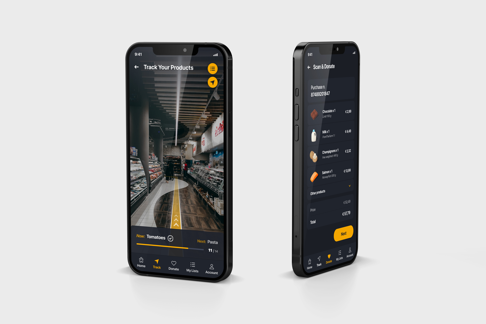

<!-- Add an *optional* hero image to provide visual context. -->

# Title

Byline

Date

<!-- Content goes here… -->

## Abstract
The topic of this bachelor´s thesis is the conception and visual identity of grocery shopping & charity mobile application. Theoretical part of the thesis includes theory of existing apps and UX, the conception and the process of designing. The main aim is to make shopping easier and quicker, but also to make charity more common. Practical part is analysis of buyer's needs at first, then the designing and preparing of the functional prototype of the app.

### Keywords: 
Mobile Application, User Experience, Graphic Design, Visual Identity

## Article

<!-- Expanded article based on outline. -->
