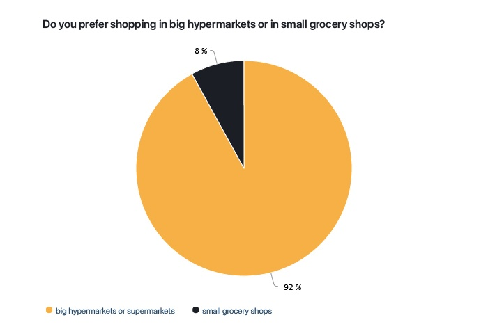

<!-- Add an *optional* hero image to provide visual context. -->

# Grocery Shopping Navigation Application

## Abstract
The topic of this bachelor thesis is the conception and visual identity of grocery shopping & charity mobile application. The theoretical part of the thesis includes the theory of existing applications and UX, the concept and my design process. The main aim of the work is to make shopping easier and quicker, but also to make charity more common. The practical part is an analysis of buyer's needs at first, then the designing based on user's needs performed from analysis, and the creation of a functional prototype of the application. 

### Keywords: 
Mobile Application, Grocery Shopping, Charity, User Experience, Graphic Design, Visual Identity

## How it all started?
I know it happends to me quite often, that I need to buy a product and I look for it for a long time, and when this happends, I am walking among the shelves all over again, but I still can not find, what I am looking for. I liked this idea, because it doesn't exist yet, so I thought it would be fine to make a conception of app like this as my bachelor thesis.

## Story
The thesis starts with a customer analysis, the aim was to find out how customers behave while shopping, what obstacles are they going through and what their opinion is about charity in general and about donating money to charities. The analysis came up with some really important facts. People visit supermarkets or hypermarkets more than the small groceries. It happends to them that they are looking for some products for a long time and they feel bothered by that. One of the interesting facts was also the one, that people would like to donate more money, if they have the opportunity of such an app. I was not only designing, but also the concept of collaboration with shops was prepared.

## Analysis

The results show that more than two thirds of customers prefer a personal visit to the store, they like to choose the products themselves, even though most of them have the opportunity to use food import services, but they still prefer to shop themselves.

One of the important findings is also that respondents choose mainly supermarkets or hypermarkets, so the application should be ready for cooperation with large chains.

### Result
The process of making the app was in respect to this analysis and customer's issues and needs, but also in respect to User Experience and User Interface. The app has two main functions – to navigate and to donate – but also some more minor functions as saving the shopping lists. The result is a completely finished design in light and dark mode, issues situations that can happen were prepared and designed too, and a clickable prototype to try the app out.

