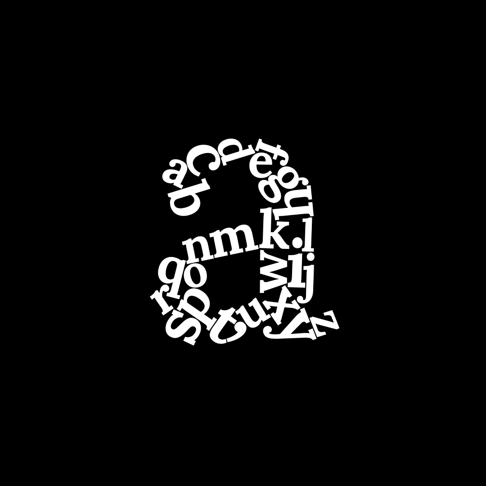

###### *A*, by Michaela Adamcova, Vector in Adobe Illustrator

---

#### Lowercase "a" made up of all 26 letters of the alphabet.

---

##### *Life is made up of each and every day spent, exactly as our language we communicate with. Every day matters.*
